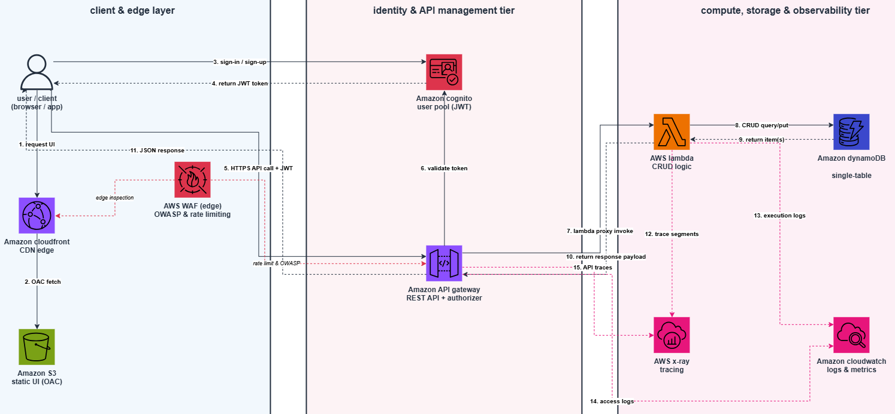

serverless rest api with cognito, dynamodb and waf

graduation project for the aws solutions architect associate track.

this project implements a serverless rest api that lets authenticated users securely create, read, and delete personal records. it utilizes amazon api gateway, aws lambda, and amazon dynamodb, with user authentication handled by amazon cognito and perimeter edge protection managed by aws waf.

architecture diagram



how it works

1. the user requests static frontend assets hosted on amazon s3 through amazon cloudfront.
2. the user authenticates via an amazon cognito user pool, which validates credentials and returns a secure json web token access or id token.
3. the user sends https api requests containing the bearer token to amazon api gateway.
4. aws waf inspects incoming traffic at the edge to block malicious payloads, mitigate automated threats, and enforce ip rate limits.
5. amazon api gateway validates the jwt token signature natively using the built-in cognito authorizer.
6. api gateway invokes the backend aws lambda function using proxy integration.
7. the lambda function executes crud operations against the amazon dynamodb table, strictly scoped to the caller's unique user id.
8. telemetry data, access logs, and distributed trace segments are streamed continuously to amazon cloudwatch and aws x-ray.

tech stack and aws services

- amazon s3 and cloudfront: static file hosting and global content delivery via edge locations.
- aws waf: edge security enforcing owasp top 10 rules and strict ip rate-limiting.
- amazon cognito: identity directory, user sign-up and sign-in flows, and secure jwt token issuance.
- amazon api gateway: fully managed rest api endpoints with native cognito authorizer integration and request validation.
- aws lambda (python 3.12): serverless backend compute running core business logic.
- amazon dynamodb: single-table nosql data store configured with on-demand capacity.
- aws x-ray and cloudwatch: application performance monitoring, log aggregation, and end-to-end distributed tracing.

database design

the project uses a single dynamodb table designed for optimal access patterns and strict tenant isolation:
- table name: serverless-records-table
- billing mode: on-demand (pay per request)
- partition key (userid): string (maps directly to the cognito sub claim)
- sort key (itemid): string (unique identifier for each individual record)
- item attributes: title (string), description (string), createdat (string)

api endpoints

- post /items: create a new item for the authenticated user (auth required: yes, bearer token)
- get /items: retrieve all items belonging to the caller (auth required: yes, bearer token)
- get /items/{id}: fetch a single item by id (auth required: yes, bearer token)
- delete /items/{id}: delete an item by id (auth required: yes, bearer token)

all in one deployment and testing script

save the following script as deploy.sh and run it to set up the entire infrastructure and test the api automatically:

```bash
#!/bin/bash
set -e

region="us-east-1"
account_id=$(aws sts get-caller-identity --query 'Account' --output text)

echo "1. creating dynamodb table..."
aws dynamodb create-table \
    --table-name serverless-records-table \
    --attribute-definitions \
        AttributeName=userId,AttributeType=S \
        AttributeName=itemId,AttributeType=S \
    --key-schema \
        AttributeName=userId,KeyType=HASH \
        AttributeName=itemId,KeyType=RANGE \
    --billing-mode PAY_PER_REQUEST || echo "table might already exist"

echo "2. creating cognito user pool and client..."
user_pool_id=$(aws cognito-idp create-user-pool \
    --pool-name serverless-api-userpool \
    --auto-verified-attributes email \
    --query 'UserPool.Id' --output text)

client_id=$(aws cognito-idp create-user-pool-client \
    --user-pool-id $user_pool_id \
    --client-name serverless-web-client \
    --no-generate-secret \
    --explicit-auth-flows USER_PASSWORD_AUTH \
    --query 'UserPoolClient.ClientId' --output text)

echo "user pool id: $user_pool_id"
echo "client id: $client_id"

echo "3. deploying lambda backend..."
cd backend/
zip -r function.zip lambda_function.py

aws lambda create-function \
    --function-name records-api-handler \
    --runtime python3.12 \
    --handler lambda_function.lambda_handler \
    --role arn:aws:iam::${account_id}:role/LambdaServerlessDynamoDBRole \
    --zip-file fileb://function.zip \
    --environment "Variables={TABLE_NAME=serverless-records-table}" \
    --tracing-config Mode=Active || echo "lambda might already exist"

cd ..

echo "4. configuring api gateway rest api..."
api_id=$(aws apigateway create-rest-api \
    --name records-service-api \
    --query 'id' --output text)

aws apigateway create-authorizer \
    --rest-api-id $api_id \
    --name CognitoAuth \
    --type COGNITO_USER_POOLS \
    --provider-arns arn:aws:cognito-idp:${region}:${account_id}:userpool/$user_pool_id \
    --identity-source method.request.header.Authorization

echo "deployment completed successfully!"
